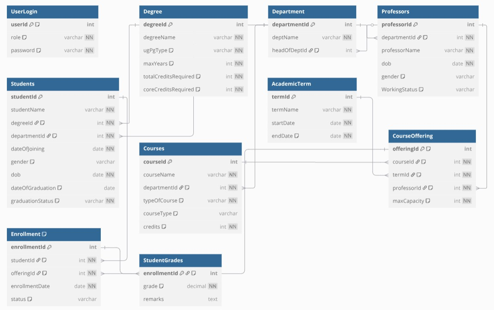

# University Management System (UMS)

The **University Management System (UMS)** is a full-stack web application that streamlines day-to-day academic operations for students professors and administrators.  It is built with **Flask 2.3**, **PostgreSQL 15** and **SQLAlchemy 2**, and organised into clearly separated front-end templates and back-end routes for each user role.

## Project Highlights

* Three dedicated portals (**Admin**, **Professor**, **Student**) with role-based authentication through the `UserLogin` table and session-level `SET ROLE` commands in PostgreSQL.
* Rich database layer featuring 13 core tables, 4 system sequences, 9 views, 28 stored procedures / functions and 5 trigger pairs that enforce business rules entirely inside the DBMS.
* Dynamic course-registration workflow:  
  * Students add / drop offerings under automatic 24-credit caps  
  * Professors approve pending requests with live capacity checks  
  * Admins open / close the two phases by toggling server-side flags.
* End-to-end grade management: professors upload marks, grading triggers create blank rows, views translate numeric grades to letters, and SQL helpers compute SGPA / CGPA in real time.

## Technology Stack

| Layer | Component | Purpose |
|-------|-----------|---------|
| Front-end | Jinja2 + HTML/CSS (per-role stylesheets in `static/css`) | Responsive dashboards and forms |
| Back-end | Flask (`app.py`) | Route handling, flash messaging, login sessions |
| ORM / DB driver | SQLAlchemy 2 + psycopg2-binary | Secure parameterised queries and transaction management |
| Database | PostgreSQL 15 | All relational logic, constraints, triggers and analytics |

## Database Schema



## Database Architecture

### 1. Core Entities

| Table | Key Columns | Notes |
|-------|-------------|-------|
| **Degree** | `degreeId` (PK), `ugPgType`, `maxYears`, credit requirements | Supports UG / PG separation with CHECK constraints |
| **Department** | `departmentId` (PK), `headOfDeptId` (FK) | HOD assignment enforced by procedure `assign_hod` |
| **Professors** | `professorId` (PK), `WorkingStatus` | Trigger deletes login on status change to *Departed* |
| **Students** | `studentId` (PK), `graduationStatus` | Trigger deletes login on *Discontinued* status |
| **Courses** | `courseId` (PK), `typeOfCourse` (UG/PG), `courseType` (Theory/Lab) | Credit value limited to 5 by CHECK |
| **AcademicTerm** | `termId` (PK), `startDate`, `endDate` | `can_add_new_term()` blocks overlap with active term |
| **CourseOffering** | `offeringId` (PK), FK to course/term/professor | `offering_id_seq` auto-generates IDs |
| **Enrollment** | `enrollmentId` (PK), status ENUM | UNIQUE (studentId,offeringId) prevents duplicates |
| **StudentGrades** | `enrollmentId` (PK), `grade` (0–100) | Populated by trigger on enrollment approval |
| **UserLogin** | composite of `role`, `userId` (PK) | Stores hashed* passwords per role; only Admin can mutate |

\*Passwords are stored plainly in the sample data set for demonstration; replace with hashing in production.

### 2. Referential Integrity

All foreign keys cascade on delete where safe (`ON DELETE SET NULL` for HOD) and block destructive actions otherwise.  Non-clustered indexes accelerate frequent look-ups (e.g. hashed index on `Enrollment.studentId`).

### 3. Sequences & Surrogate Keys

```pgsql
CREATE SEQUENCE offering_id_seq START 4000001;
```

is referenced as the default for `CourseOffering.offeringId`, ensuring gap-free, concurrent-safe identifiers.

## Business-Logic Routines

| Category | Routine | Objective |
|----------|---------|-----------|
| **Admin utilities** | `get_next_student_id()`, `insert_student`, `delete_student` | Auto-allocate IDs and manage enrollee lifecycle |
|  | `get_next_professor_id()`, `insert_professor`, `delete_professor` | Enforce HOD check before marking *Departed* |
|  | `insert_department`, `insert_degree`, `insert_course`, `insert_academic_term` | Data-entry w/ validation (credits, dates, duplicate detection) |
| **Registration** | `check_pending_credits()` (trigger), `CheckCourseCapacity()` | Hard 24-credit student cap and seat-count gate |
| **Reporting** | `get_course_offerings_by_term()` | Multi-table join returning full public timetable |
|  | `get_registration_log`, `getAddDropCourses` | Student-centric views of current and historic enrolments |
| **Grading** | `GetCourseAverageGrade`, `GetCourseStdDevGrade`, `CountGradedStudents` | Live class statistics for professors |
|  | `get_term_grades`, `get_sgpa`, `get_cgpa` | Computes per-term and cumulative GPAs |

All procedures are written in **PL/pgSQL**, committed under `ums.sql`, and invoked from Flask via parameterised `CALL` or `SELECT` statements for maximum performance and security.

## Triggers & Views

1. **Enrollment Workflow**  
   * `trg_Check_pending_credits` (BEFORE INSERT/UPDATE) → aborts when credit limit exceeded  
   * `trg_Enrollment_AfterUpdate_AddGrade` (AFTER UPDATE) → inserts zero-grade row upon approval

2. **User Account Automation**  
   * `student_after_insert` and `after_professor_insert` → auto-create `UserLogin` rows  
   * `student_status_update_trigger`, `professor_status_update_trigger` → delete logins when discontinued/departed

3. **Presentation Views** (`vw_student_course_overview`, `student_grade_details`, `vw_ProfessorCourseDetails`) supply ready-to-render data frames to the UI with minimal Python post-processing.

## Flask Application Flow

### 1. Authentication

`/login` validates the trio `(role, userId, password)` against `UserLogin`, commits `session['role']`, then issues `SET ROLE <role>` on the same connection so that PostgreSQL row-level privileges mirror the session.

### 2. Blue-ribbon Routes per Role

| Role | Landing Route | Main Functions |
|------|---------------|----------------|
| **Admin** | `/admin_dashboard` | CRUD on students, professors, courses, departments, terms; toggle registration phases |
| **Professor** | `/professor_dashboard` | Offer courses, approve enrolments, upload grades, analytic stats |
| **Student** | `/student_dashboard` | Add/drop courses, monitor registration log, view grades, download SGPA/CGPA |

### 3. Registration Two-Phase Switch

Global dict `registration_status = {'student_enrollment': bool, 'professor_approval': bool}` is toggled from `/course_registration_control`; templates conditionally block user actions based on these flags to avoid race conditions.

### 4. Error Handling & Flashing

All critical DB calls are wrapped in `try/except` blocks; rollback on error and emit category-tagged `flash()` messages that Bootstrap's alert classes render in the front-end.

## Local Setup

```bash
# 1. Clone repository
git clone https://github.com/112201019/University_management_system.git
cd University_management_system

# 2. Create virtual environment
python -m venv venv
source venv/bin/activate  # Windows: venv\Scripts\activate

# 3. Install dependencies
pip install -r requirements.txt     # Flask, SQLAlchemy, psycopg2-binary, python-dotenv

# 4. Create PostgreSQL database
psql -U postgres
CREATE DATABASE UMS_final;
\q

# 5. Load schema & sample data
psql -U postgres -d UMS_final -f ums.sql

# 6. Run the server
python app.py  # default localhost:5000
```

Environment variables (`.env`) may override the hard-coded `USER_NAME`, `PASSWORD`, etc., in production.

## Usage Guide

### 1. Administrator

1. Log in as **admin** (`userId=9999999`, password identical in seed data).  
2. Navigate through the sidebar to:
   * *Students* → add / edit / discontinue  
   * *Professor* → onboard faculty, mark departures, assign HOD  
   * *Courses* → insert new offerings, publish timetable  
   * *Course Registration* → open/close student or professor phase  
   * *Add Degree / Department / Term* → extend curricula

### 2. Professor

* **Offer Courses**: propose section and capacity for the active term.  
* **Students Registration**: approve / reject pending requests until capacity reached.  
* **Submit Grades**: enter marks in bulk; system shows average, σ and count live.

### 3. Student

* **Course Registration**: add/drop within credit limits; see eligibility (core vs elective) per offering.  
* **My Courses**: view approved list by term.  
* **View Grades**: fetch term grades plus computed SGPA & CGPA.

## Security & Best Practices

* Parameterised queries throughout SQLAlchemy prevent injection.  
* Database roles *admin*, *professor*, *student* restrict CRUD scope at the engine level.  
* CHECK constraints, NOT NULLs and trigger guards enforce invariants even if the Flask layer is bypassed.  
* Replace plain-text passwords with salted hashes (`werkzeug.security`) before production rollout.

## Contributing

1. Fork the repository and create a feature branch.  
2. Write unit tests for any new stored procedure or Flask route.  
3. Follow PEP 8 and commit with descriptive messages.  
4. Open a pull request—CI will run schema-diff and linter checks.

## License

This project is released under the **MIT License**.  Feel free to use, modify and distribute with attribution.

### Acknowledgements

**Development Team:**

| Team Member | Role & Responsibilities |
|-------------|------------------------|
| [Sriram](https://github.com/112201019) | **Admin Portal Developer** - Complete frontend and backend development for the admin portal, including user management, course administration, department management, and system configuration features |
| [Venkat Rohith](https://github.com/JUTURUVENKATROHTH) | **Professor Portal Developer** - Complete frontend and backend development for the professor portal, including course offerings, student enrollment approval, grade management, and academic analytics |
| [Bhavani Shankar](https://github.com/GBhavaniShankar) | **Student Portal Developer** - Complete frontend and backend development for the student portal, including course registration, enrollment tracking, grade viewing, and SGPA/CGPA calculation features |

**Collaborative Contributions:**

* **Database Architecture & Design** - Jointly designed and implemented by all three team members, including the 13 core tables, stored procedures, triggers, views, and referential integrity constraints
* **System Integration** - Coordinated effort to ensure seamless integration between all three portals and the shared database layer

**Technical Achievements:**

* Role-based authentication system with PostgreSQL security roles
* 28 stored procedures and functions for business logic implementation
* 5 trigger pairs for automated data integrity and workflow management
* Comprehensive grade management system with real-time GPA calculations

This project represents the collective expertise and dedication of our team, demonstrating effective collaboration in full-stack web development and database system design.
